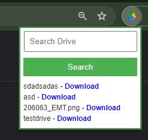
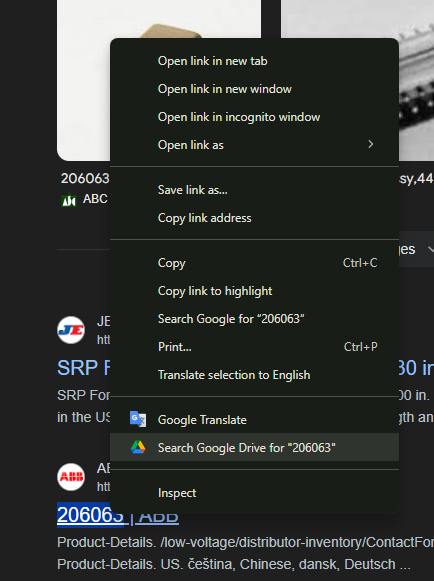
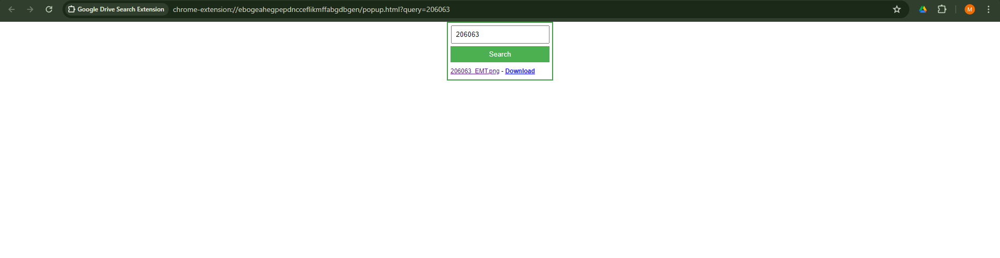

GoogleDriveExtension
The google drive extension is used to display the Google Drive folders and files that the user contains.
First you need to login to the extention and after that you can use it. Here is an example:

There is a good feature when you select a text you can immediately search the text on the google drive extension and find the result. Shown below

After you click on the button there will be page displayed with the searched results

